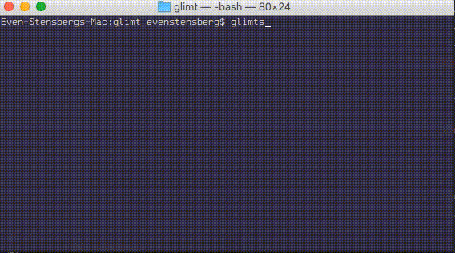

# :tropical_drink: Lindir :tropical_drink:




>Lindir is a library, more or less a direct copy of Sindre Sorhus´s [Ora](https://github.com/sindresorhus/ora). Use Spinners for the terminal and choose your own spinners on changes.


[](https://npmjs.org/package/lindir)

#Installation

>`npm install --save lindir`

#Example

```js
const Lindir = require('lindir');

const spinner = new Lindir('Loading stuff').start();

  setTimeout(() => {
      spinner.color = 'green';
      spinner.type = 'peace';
      spinner.text = 'Loading more stuff';
  }, 1000);
```

For a description of what spinners you can use, have a look at our [build](https://github.com/ev1stensberg/lindir/blob/master/spinners.json) or Sindre Sorhus´s package, [CLI-spinners](https://github.com/sindresorhus/cli-spinners)

#Special Thanks

I'd like to thank [Sindre](https://twitter.com/sindresorhus) for making [Ora](https://github.com/sindresorhus/ora). As mentioned, this is a copy of his implementation, and all credit goes to him.

#License

Copyright (c) 2016 Even Stensberg & Sindre Sørhus

Permission is hereby granted, free of charge, to any person obtaining a copy of this software and associated documentation files (the "Software"), to deal in the Software without restriction, including without limitation the rights to use, copy, modify, merge, publish, distribute, sublicense, and/or sell copies of the Software, and to permit persons to whom the Software is furnished to do so, subject to the following conditions:

The above copyright notice and this permission notice shall be included in all copies or substantial portions of the Software.

THE SOFTWARE IS PROVIDED "AS IS", WITHOUT WARRANTY OF ANY KIND, EXPRESS OR IMPLIED, INCLUDING BUT NOT LIMITED TO THE WARRANTIES OF MERCHANTABILITY, FITNESS FOR A PARTICULAR PURPOSE AND NONINFRINGEMENT. IN NO EVENT SHALL THE AUTHORS OR COPYRIGHT HOLDERS BE LIABLE FOR ANY CLAIM, DAMAGES OR OTHER LIABILITY, WHETHER IN AN ACTION OF CONTRACT, TORT OR OTHERWISE, ARISING FROM, OUT OF OR IN CONNECTION WITH THE SOFTWARE OR THE USE OR OTHER DEALINGS IN THE SOFTWARE.
